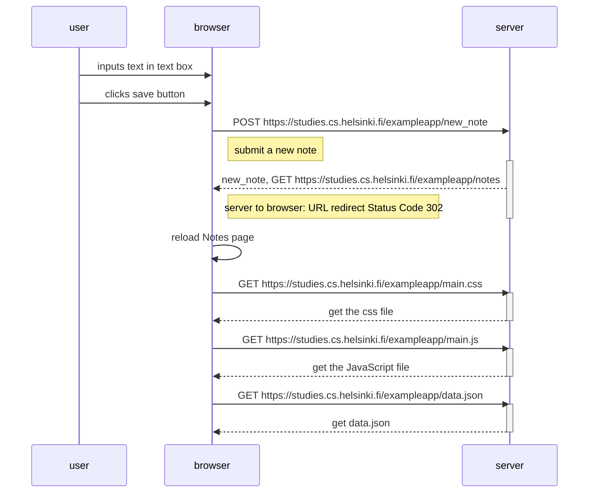

## Exercise 0.4 Submit Text in Notes Page Diagram

```mermaid
sequenceDiagram
    participant user
    participant browser
    participant server

    user->>browser: inputs text in text box
    user->>browser: clicks save button


    browser->>server: POST https://studies.cs.helsinki.fi/exampleapp/new_note
    Note right of browser: submit a new note
    activate server
    server-->>browser: new_note, GET https://studies.cs.helsinki.fi/exampleapp/notes
    Note right of browser: server to browser: URL redirect Status Code 302
    deactivate server

    browser->>browser: reload Notes page

    browser->>server: GET https://studies.cs.helsinki.fi/exampleapp/main.css
    activate server
    server-->>browser: get the css file
    deactivate server

    browser->>server: GET https://studies.cs.helsinki.fi/exampleapp/main.js
    activate server
    server-->>browser: get the JavaScript file
    deactivate server

    browser->>server: GET https://studies.cs.helsinki.fi/exampleapp/data.json
    activate server
    server-->>browser: get data.json
    deactivate server

```